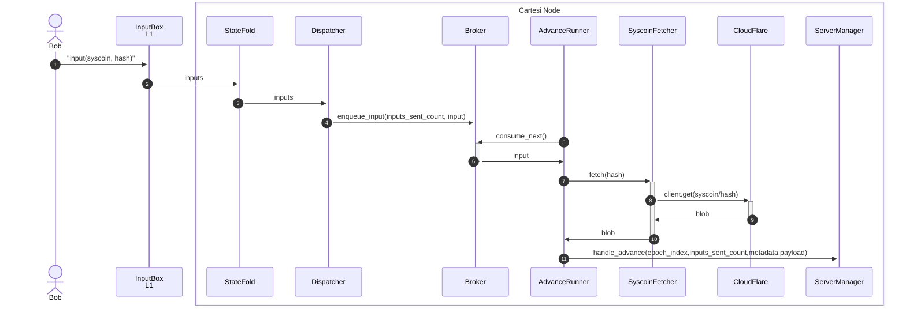

```mermaid
%%{
  init: {
    "sequence": {
      "mirrorActors": true,
      "messageAlign": "center"
    }
  }
}%%
sequenceDiagram
  actor Bob
  participant InputBox as InputBox<br>L1
  box Cartesi Node
    participant StateFold
    participant Dispatcher
    participant Broker
    participant AdvanceRunner
    participant SyscoinFetcher
    participant CloudFlare
    participant ServerManager
  end
  autonumber

  # BOB Stores the Data
  Bob->>+InputBox: "input(syscoin, hash)"
  InputBox->>+StateFold: inputs
  StateFold->>+Dispatcher: inputs
  Dispatcher->>+Broker: enqueue_input(inputs_sent_count, input)
  AdvanceRunner->>+Broker: consume_next()
  Broker->>-AdvanceRunner: input
  AdvanceRunner->>+SyscoinFetcher: fetch(hash)
  SyscoinFetcher->>+CloudFlare: client.get(syscoin/hash)
  CloudFlare->>-SyscoinFetcher: blob
  SyscoinFetcher->>-AdvanceRunner: blob
  AdvanceRunner->>+ServerManager: handle_advance(epoch_index,inputs_sent_count,metadata,payload)
```