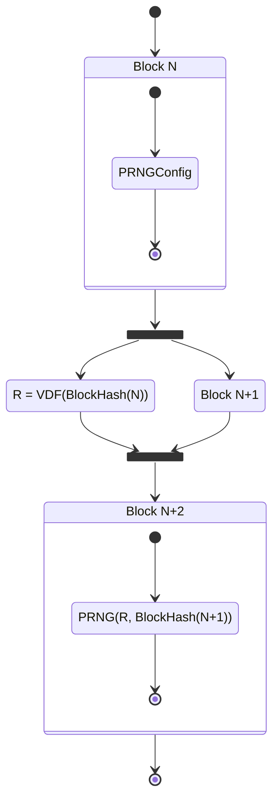

```mermaid
stateDiagram-v2
  BlockHash0: Block N
  BlockHash1: Block N+1
  BlockHash2: Block N+2
  VDF: R = VDF(BlockHash(N))
  Seed: PRNG(R, BlockHash(N+1))
  state fork_state <<fork>>

  [*] --> BlockHash0
  state BlockHash0 {
    [*] --> PRNGConfig
    PRNGConfig --> [*]
  }
  BlockHash0 --> fork_state
  fork_state --> VDF
  fork_state --> BlockHash1

  state join_state <<join>>
  VDF --> join_state
  BlockHash1 --> join_state
  join_state --> BlockHash2
  state BlockHash2 {
    [*] --> Seed
    Seed --> [*]
  }
  BlockHash2 --> [*]
```