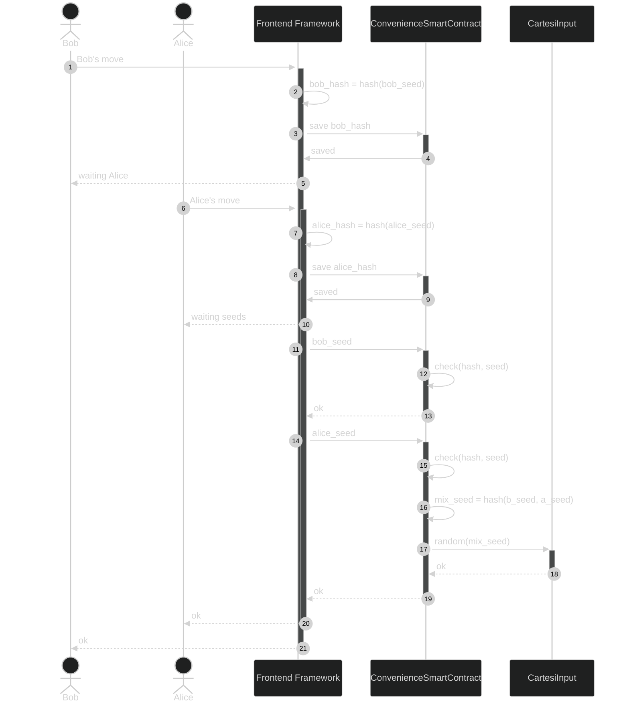

```mermaid
%%{
  init: {
    "theme": "dark",
    "sequence": {
      "mirrorActors": true,
      "messageAlign": "left"
    }
  }
}%%
sequenceDiagram
  actor Bob
  actor Alice
  participant Frontend as Frontend Framework
  autonumber
  Bob->>+Frontend: Bob's move
  activate Frontend
  Frontend->>Frontend: bob_hash = hash(bob_seed)
  Frontend->>+ConvenienceSmartContract: save bob_hash
  ConvenienceSmartContract->>-Frontend: saved
  Frontend-->>Bob: waiting Alice

  Alice->>Frontend: Alice's move
  activate Frontend
  Frontend->>Frontend: alice_hash = hash(alice_seed)
  Frontend->>+ConvenienceSmartContract: save alice_hash
  ConvenienceSmartContract->>-Frontend: saved
  Frontend-->>Alice: waiting seeds


  Frontend->>+ConvenienceSmartContract: bob_seed
  ConvenienceSmartContract->>ConvenienceSmartContract: check(hash, seed)
  ConvenienceSmartContract-->>-Frontend: ok
  Frontend->>+ConvenienceSmartContract: alice_seed
  ConvenienceSmartContract->>ConvenienceSmartContract: check(hash, seed)
  ConvenienceSmartContract->>ConvenienceSmartContract: mix_seed = hash(b_seed, a_seed)
  
  ConvenienceSmartContract->>+CartesiInput: random(mix_seed)
  CartesiInput-->>-ConvenienceSmartContract: ok

  ConvenienceSmartContract-->>-Frontend: ok
  Frontend-->>Alice: ok
  deactivate Frontend
  Frontend-->>Bob: ok
  deactivate Frontend
```