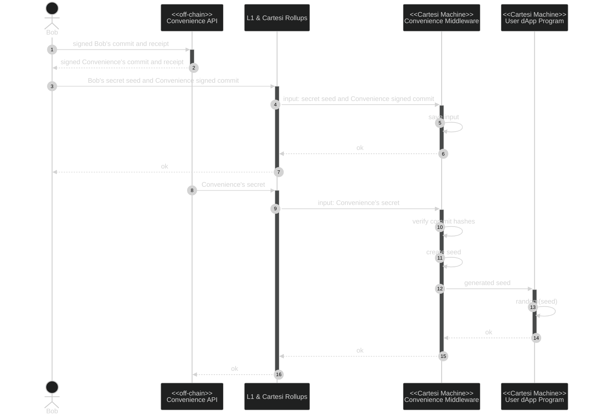

Bob starts a new random number process by calling the REST Convenience API. Bob’s payload includes a signed receipt that can be executed by the Convenience Service if Bob fails to reveal his secret. The Convenience API responds with a signed commit and receipt.

We know that the user’s dApp calls the rollup server, we change the arrow direction to make the problem easier to think about. In reality, dApps will call our middleware and our middleware will call the rollup server.