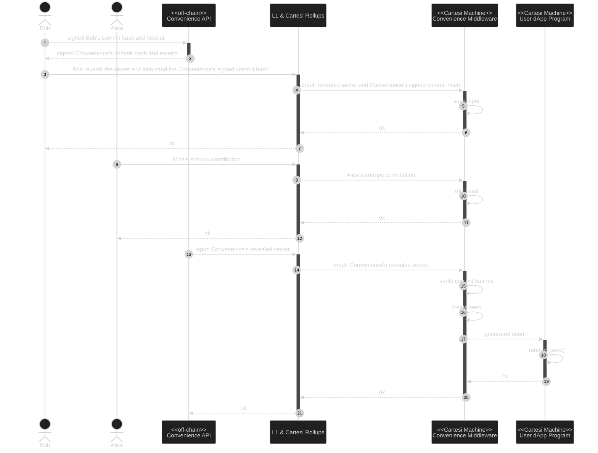

## Bob and Alice

```mermaid
%%{
  init: {
    "theme": "dark",
    "sequence": {
      "mirrorActors": true,
      "messageAlign": "center"
    }
  }
}%%
sequenceDiagram
  actor Bob
  actor Alice
  participant ConvenienceAPI as <<off-chain>><br>Convenience API
  participant CM as L1 & Cartesi Rollups
  participant ConvenienceMiddleware as <<Cartesi Machine>><br>Convenience Middleware
  participant UserProgram as <<Cartesi Machine>><br>User dApp Program
  autonumber

  Bob->>+ConvenienceAPI: signed Bob's commit hash and receipt
  ConvenienceAPI-->>-Bob: signed Convenience's commit hash and receipt

  # BOB REVEAL
  Bob->>+CM: Bob reveals the secret and also send the Convenience's signed commit hash
  CM->>+ConvenienceMiddleware: input: revealed secret and Convenience's signed commit hash
  ConvenienceMiddleware->>ConvenienceMiddleware: save input
  ConvenienceMiddleware-->>-CM: ok
  CM-->>-Bob: ok

  # Alice Mix
  Alice->>+CM: Alice's entropy contribution
  CM->>+ConvenienceMiddleware: Alice's entropy contribution
  ConvenienceMiddleware->>ConvenienceMiddleware: mix seed
  ConvenienceMiddleware-->>-CM: ok
  CM-->>-Alice: ok

  # CONVENIENCE REVEAL
  ConvenienceAPI->>+CM: input: Convenience's revealed secret
  CM->>+ConvenienceMiddleware: input: Convenience's revealed secret
  ConvenienceMiddleware->>ConvenienceMiddleware: verify commit hashes
  ConvenienceMiddleware->>ConvenienceMiddleware: create seed
  ConvenienceMiddleware->>+UserProgram: generated seed
  UserProgram->>UserProgram: random(seed)
  UserProgram-->>-ConvenienceMiddleware: ok
  ConvenienceMiddleware-->>-CM: ok
  CM-->>-ConvenienceAPI: ok

  
```