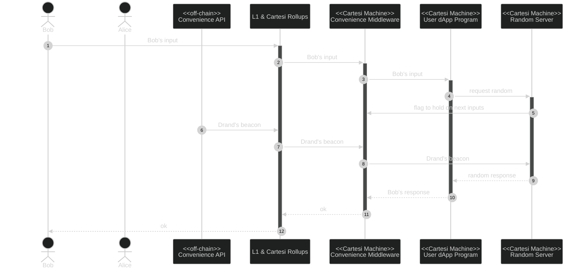
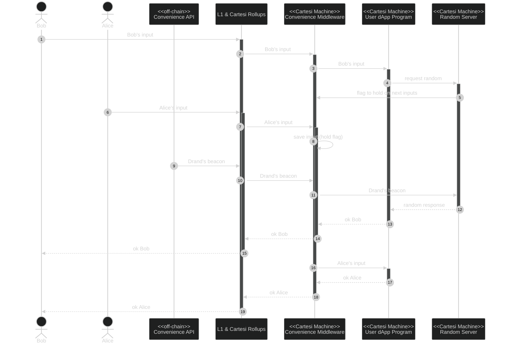

```mermaid
%%{
  init: {
    "theme": "dark",
    "sequence": {
      "mirrorActors": true,
      "messageAlign": "center"
    }
  }
}%%
sequenceDiagram
  actor Bob
  actor Alice
  participant ConvenienceAPI as <<off-chain>><br>Convenience API
  participant CM as L1 & Cartesi Rollups
  participant ConvenienceMiddleware as <<Cartesi Machine>><br>Convenience Middleware
  participant UserProgram as <<Cartesi Machine>><br>User dApp Program
  participant RandomServer as <<Cartesi Machine>><br>Random Server
  autonumber

  # BOB INPUT
  Bob->>+CM: Bob's input
  CM->>+ConvenienceMiddleware: Bob's input
  ConvenienceMiddleware->>+UserProgram: Bob's input
  UserProgram->>+RandomServer: request random
  RandomServer->>ConvenienceMiddleware: flag to hold on next inputs

  ConvenienceAPI->>CM: Drand's beacon
  CM->>ConvenienceMiddleware: Drand's beacon
  ConvenienceMiddleware->>RandomServer: Drand's beacon
  RandomServer-->>-UserProgram: random response
  UserProgram-->>-ConvenienceMiddleware: Bob's response

  ConvenienceMiddleware-->>-CM: ok
  CM-->>-Bob: ok
```
# Alice

```mermaid
%%{
  init: {
    "theme": "dark",
    "sequence": {
      "mirrorActors": true,
      "messageAlign": "center"
    }
  }
}%%
sequenceDiagram
  actor Bob
  actor Alice
  participant ConvenienceAPI as <<off-chain>><br>Convenience API
  participant CM as L1 & Cartesi Rollups
  participant ConvenienceMiddleware as <<Cartesi Machine>><br>Convenience Middleware
  participant UserProgram as <<Cartesi Machine>><br>User dApp Program
  participant RandomServer as <<Cartesi Machine>><br>Random Server
  autonumber

  # BOB INPUT
  Bob->>+CM: Bob's input
  CM->>+ConvenienceMiddleware: Bob's input
  ConvenienceMiddleware->>+UserProgram: Bob's input
  UserProgram->>+RandomServer: request random
  RandomServer->>ConvenienceMiddleware: flag to hold on next inputs

  # ALICE INPUT
  Alice->>+CM: Alice's input
  CM->>+ConvenienceMiddleware: Alice's input
  ConvenienceMiddleware->>ConvenienceMiddleware: save input (hold flag)

  ConvenienceAPI->>CM: Drand's beacon
  CM->>ConvenienceMiddleware: Drand's beacon
  ConvenienceMiddleware->>RandomServer: Drand's beacon
  RandomServer-->>-UserProgram: random response
  UserProgram-->>-ConvenienceMiddleware: ok Bob

  ConvenienceMiddleware-->>-CM: ok Bob
  CM-->>-Bob: ok Bob

  ConvenienceMiddleware->>+UserProgram: Alice's input
  UserProgram-->>-ConvenienceMiddleware: ok Alice
  ConvenienceMiddleware-->>-CM: ok Alice
  CM-->>-Bob: ok Alice
```

Anyone can send the Drand's beacon.
