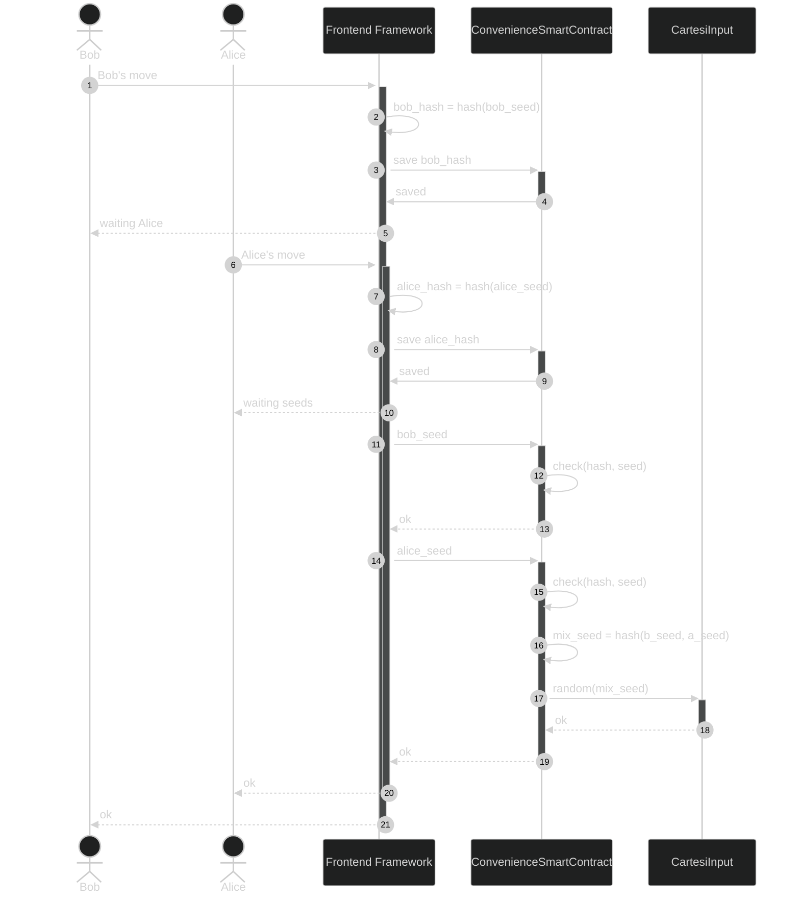

## PRNG Convenience

**Cartesi PRNG**

Our framework will offer some options to generate random numbers that will make it easy for web3 developers to create DApps using Cartesi.

**Project Description**
<!-- [Write the description long-form here, or else paste a [google drive link](https://url/) to a slide deck]
-->
The goal of this project is to create a framework for Cartesi that will make it easy for web3 developers to create DApps using Cartesi. The framework will use React and TypeScript to create a modular and reusable component library that will provide a common PRNG algorithm to Cartesi technology. The framework will also use Web3.js and Cartesi's SDK to connect to the blockchain and the Cartesi Machine. The framework will follow the best practices of web development and design. The framework will be tested with Jest and documented with Docusaurus. The framework will be published on npm and GitHub and maintained with semantic versioning.

Our project will offer three different ways to generate random numbers, each with its own advantages and disadvantages:
1. The first type uses block number, clock, and end user ethereum address to make a seed. This is a simple way to generate a seed that depends on some external factors that are hard to predict or manipulate. However, this type of PRNG may not be very secure or random, as it may be vulnerable to attacks or biases.
2. The second type uses a hash function for a number to generate the seed. This is a more secure and random way to generate a seed, as hash functions are designed to produce outputs that are unpredictable and uniformly distributed. However, this type of PRNG may require more transaction steps and may not be very efficient.
3. The third type uses Chainlink, which is a decentralized oracle network that provides access to various sources of randomness. This is a reliable and verifiable way to generate a seed, as Chainlink uses multiple nodes and cryptographic proofs to ensure the quality and integrity of the randomness. However, this type of PRNG may involve some costs and delays, as it depends on the availability and performance of the Chainlink network3.

**Value proposition**
<!-- [Why would someone use this product/service? Or how does it add value to the Cartesi ecosystem or tech stack?]
-->

The main contributions and benefits of this framework are:
- It will increase the adoption and innovation of Cartesi by lowering the barriers of entry for web3 developers who want to create DApps using Cartesi.
- It will enhance the user experience and satisfaction of game developers by providing a user-friendly interface for interacting with Cartesi technology.
- It will foster the growth and development of the Cartesi community by providing a valuable resource and tool for DApp developers.

## How you will use Cartesi, specifically?

<!--[Details about how you're using Cartesi specifically, and why it makes sense. This is the most important part of the proposal. If you are not precise, or your intention is not feasible, the proposal will be rejected.]-->

This framework aims to help developers build games that use Cartesi’s features, such as verifiable computation, massive data processing, and interoperability. 
Some examples of the types of games that can be built with this framework are:
- A decentralized soccer game that uses Cartesi’s random algorithm to generate fair and unpredictable moves for both players.
- A decentralized card game that uses Cartesi’s off-chain computation to handle encryption algorithms and game logic to randomize the deck.
- RPG games that use PRNGs to determine loot drops, enemy spawns, critical hits, etc. 

### Hashed Turn Based Seed for PRNG

## Milestones

**Milestone 1: Simple PRNG**

* Duration: 1 months

* Deliverables: 
[what will be produced, accomplished, or demonstrated by the end of this period?]

* Funds request (USD) for milestone 1: [$x USD]

**Milestone 2: Hashed Turn Based Seed for PRNG**

* Duration: 1 months

* Deliverables: 
<!--[what will be produced, accomplished, or demonstrated by the end of this period?]-->

* Funds request (USD) for milestone 2: [$x USD]

**Milestone 3: Chainlink VRF**

* Duration: 1 months

* Deliverables: 
<!--[what will be produced, accomplished, or demonstrated by the end of this period?]-->

* Funds request (USD) for milestone 3: [$x USD]

## Total funds requested

### $[sum of funds requested for milestones 1, 2, and 3] USD

Use of funds (specific breakdown):

* [List item: price in usd]
* [List item: price in usd]
* [List item: price in usd]
* [List item: price in usd]
* [List item: price in usd]
* [List item: price in usd]

## About your Team

<!-- ordem alfabetica -->
<!--*[person 1]*-->
*Bruno Ochotorena*

Web3 Developer

*Fabio Oshiro*

Web3 Developer

*Felipe Soares*

[Details about their role in the project]

Relevant Experience

* [We ran a Solana DApp on Ethereum using Cartesi](https://blog.calindra.com.br/we-ran-a-solana-dapp-on-ethereum-using-cartesi-35da59ed1e47)
  * [Open-Source: Cartesi’s Solana adapters](https://blog.calindra.com.br/solana-cartesi-under-the-hood-c4fbef266c89)

## Links and resources

Website: [https://url/ ](https://url/)
Social: [https://url/ ](https://url/)
Github: [https://url/ ](https://url/)

## ERC-20 Payee address

[your proposal will be rejected if you do not list a payee address. This address is where payments for the milestones will be made. The address must be a mainnet Ethereum ERC-20 address that can accept USDC.
