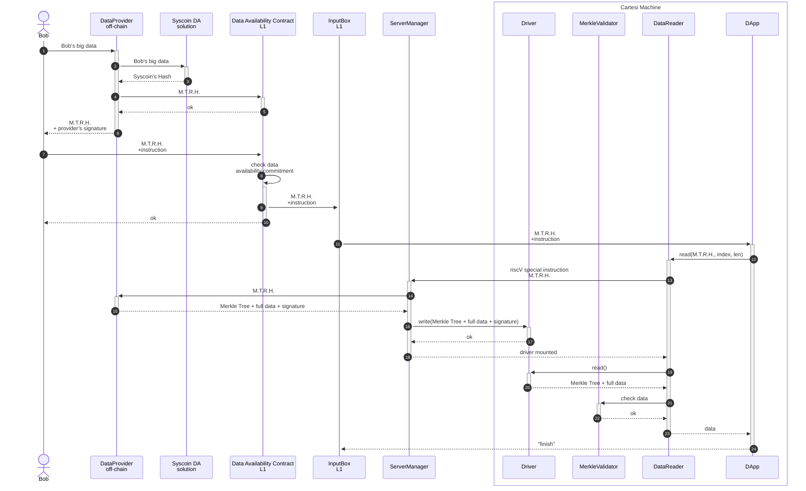
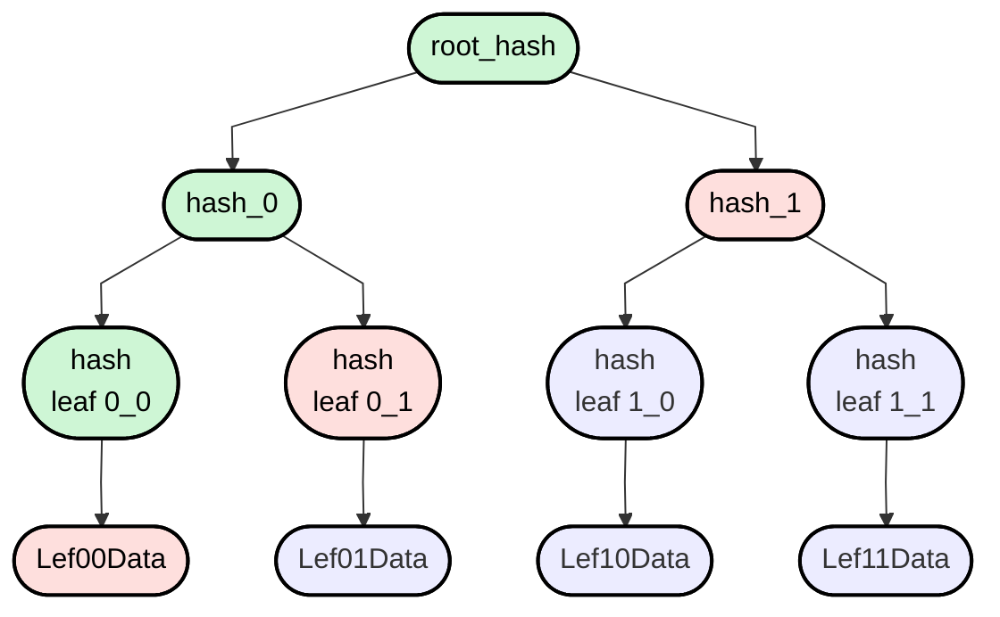

Draft:

<!--  -->


M.T.R.H. = Merkle Tree Root Hash

The chunk size is 10 characters to simplify.

1. Bob sends the data to Data Provider `"Leaf00DataLeaf01DataLeaf10DataLeaf11Data"`
2. The Data Provider sends the data to Syscoin DA.
3. The DA stores the data and returns a hash of the data: `SyscoinHash`
4. The Data Provider appends the Syscoin's hash to the data and make a merkle tree[1]:
```json
{
    "merkleTree": ["rootHash", "hash 0", "hash 1", "hash leaf 0-0", "hash leaf 0-1", "hash leaf 1-0", "hash leaf 1-1"],
    "data": "Leaf00DataLeaf01DataLeaf10DataDataLeaf11Data",
    "hash": "SyscoinHash"
}
```
5. Bob checks the hash `SyscoinHash` and the `merkleTree`.
6. Bob sends the instruction to the `Data Availability Contract` + M.T.R.H.
7. The `Data Availability Contract` verifies the data availability (6 hours).
8. The `Data Availability Contract` sends the parameters to `InputBox`.
9. The `DApp` requests the data from the `DataReader`.
10. The `DataReader` calls any `DataProviders` to fulfill the request.
11. The `MerkleValidator` checks the `SyscoinHash`.
12. The `MerkleValidator` checks the path of the merkle tree against the leaf data.
13. The `DataReader` returns the verified data to `DApp`.

Everything will be computed inside the Cartesi Machine.

If any part of the data is wrong, Alice should send the hashes to validate the merkle tree path to the leaf hash, the Syscoin's hash and the data chunk to L1 `Data Chunk Arbitrage` to do the arbitration process.



If the `SyscoinHash` does not match the full data, the current process of Cartesi can handle the problem.

If any path of the merkle tree is wrong, the current process of Cartesi will handle the problem.

[1] Merkle Tree Algorithm modified:
```rs
let syscoin_hash = "SyscoinHash"
let hash_leaf_0_0 = hash(syscoin_hash, "Leaf00Data");
let hash_leaf_0_1 = hash(syscoin_hash, "Leaf01Data");
let hash_leaf_1_0 = hash(syscoin_hash, "Leaf10Data");
let hash_leaf_1_1 = hash(syscoin_hash, "Leaf11Data");
let hash_0 = hash(syscoin_hash, hash_leaf_0_0, hash_leaf_0_1);
let hash_1 = hash(syscoin_hash, hash_leaf_1_0, hash_leaf_1_1);
let root_hash = hash(syscoin_hash, hash_0, hash_1);
```

### Scenario 1

Chuck fetches the data, validates the data, and performs an operation with 1 bit flipped.

```js
let data = fetch(hash) // Chuck and Alice disagree -> no way to tell who is correct
validate(data, hash)   // Chuck and Alice disagree -> here the CM process will handle the problem
let res = 2 * data[0]  // Chuck and Alice disagree
```

```js
let data = fetch(hash) // Chuck and Alice agree
validate(data, hash)   // Chuck and Alice agree
let res = 2 * data[0]  // Chuck and Alice disagree -> here the CM process will handle the problem
```
